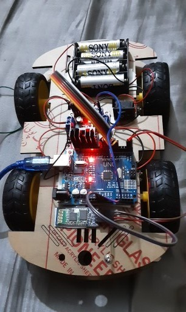

# bluetooth_controller_car

# Bluetooth Controlled RC Car Project

Welcome to the **Bluetooth Controlled RC Car** project repository! 🚗🔌

This project combines the power of Arduino, Bluetooth technology, and motor control to create a remotely controlled car that you can drive using your Android smartphone. Say goodbye to traditional remote controls and say hello to the future of wireless car control!

## Components and Supplies

- Arduino UNO
- HC-05 Bluetooth module
- SparkFun Dual H-Bridge motor drivers L298
- Pimoroni maker essentials – Micro-motors & Grippy Wheels
- Jumper wires
- Li-ion Battery 1000mAh
- LEDs

## Introduction

The **Bluetooth Controlled RC Car** project brings together various components to create a wirelessly controlled car using an Arduino UNO and Bluetooth technology. The system enables you to control the car's movement by sending commands from your Android smartphone.

### Arduino UNO

The Arduino UNO is an open-source microcontroller board based on the ATmega328P microcontroller. It features digital and analog input/output pins that can interface with various expansion boards (shields) and other circuits. The UNO is programmable using the Arduino IDE and can be powered by USB or an external battery.

### HC-05 Bluetooth Module

The HC-05 Bluetooth module is designed for wireless communication and can be used in both master and slave configurations. It's used in applications like wireless headsets, game controllers, and more. It operates on the IEEE 802.15.1 standardized protocol and communicates with microcontrollers using serial communication (USART).

### SparkFun Dual H-Bridge Motor Driver L298

The L298N motor driver module is a high-power driver suitable for driving DC motors and stepper motors. It's commonly used in robotics and mechatronics projects. The module can control up to 4 DC motors or 2 DC motors with direction and speed control. It uses an H-bridge circuit to control motor polarity and speed.

### Pimoroni Micro-motors & Grippy Wheels

These components provide the mobility for your RC car. The micro-motors and grippy wheels enable the car to move smoothly and effectively, whether you're driving forward, backward, or turning.

## Bluetooth Communication

The core functionality of the project lies in the Bluetooth communication between your Android smartphone and the Arduino UNO. By pairing your smartphone with the HC-05 Bluetooth module, you can send commands wirelessly to control the car's movement in various directions.

## Conclusion

The **Bluetooth Controlled RC Car** project showcases the fusion of Arduino, Bluetooth technology, and motor control to create an innovative remote-controlled car. This project not only demonstrates the power of wireless communication but also highlights the potential of IoT (Internet of Things) concepts in our daily lives. The integration of hardware and software offers a glimpse into the possibilities of smart and interconnected devices.

Feel free to explore the code and circuit diagrams in the repository. Have fun experimenting and driving your Bluetooth controlled car! 🚗📱
